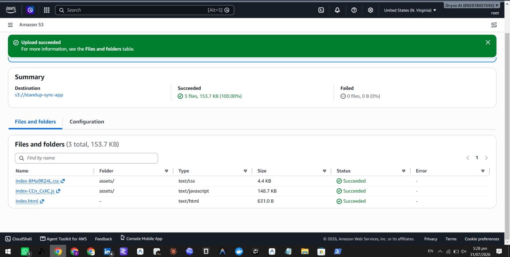
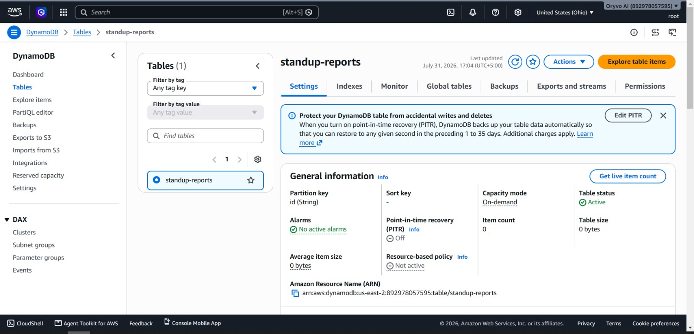

# Weekend Annoying Task Challenge: StandupSync

**Tag:** `#productivity`

---

## Vision & What the App Does

Every developer knows the pain — it's 9:25 AM, standup starts in five minutes, and you're scrambling to remember what you did yesterday. You open your terminal history, scroll through Slack threads, and check your pull requests, trying to piece together a coherent update. Meanwhile, your team's standup notes vanish into a Slack channel never to be referenced again.

**StandupSync** solves this by turning your raw task list into a clean, structured standup report with a single click. You paste what you did yesterday, what you plan to do today, and any blockers — the app structures it into a professional report, stores it in DynamoDB, and gives you a searchable history of every standup you've ever done.

The standout feature is the **weekly sprint summary** — select multiple daily reports and the app compiles them into a single sprint review with accomplishments, in-progress work, resolved blockers, active blockers, and next-week priorities. Perfect for sprint retrospectives, progress reports, or sharing with stakeholders who want the big picture without scrolling through Slack.

The core problem it solves: **manually writing and tracking standup updates is an annoying weekly chore that eats into productive time**. StandupSync makes it effortless and keeps everything organized.

---

## How You Built It

### Architecture Overview

```
┌──────────────────────┐
│   Amazon S3          │
│   (Static Website)   │  Frontend hosting
└──────────┬───────────┘
           │ HTTPS
           ▼
┌──────────────────────┐
│   API Gateway        │
│   (HTTP API)         │  4 routes → Lambda
└──────────┬───────────┘
           │
           ▼
┌──────────────────────┐
│   AWS Lambda         │
│   (Python 3.12)      │  Report generation logic
└──────────┬───────────┘
           │
           ▼
┌──────────────────────┐
│   Amazon DynamoDB    │
│   (standup-reports)  │  Persistent storage
└──────────────────────┘
```

The app follows a fully serverless architecture. A React frontend hosted on S3 calls an API Gateway HTTP API, which triggers a Lambda function. The Lambda processes the request, generates the standup report, and persists it to DynamoDB. No servers, no infrastructure to manage.

### Development Process

I built StandupSync in four layers, each building on the last:

**Layer 1: DynamoDB** — Created a single table `standup-reports` with `id` as the partition key using on-demand capacity. Kept the schema simple: each item stores the report content, user ID, timestamps, and source tasks. No secondary indexes needed since the app primarily scans and retrieves by ID.

**Layer 2: Lambda** — Wrote a Python 3.12 function that handles four routes: generating daily reports, listing all reports, fetching a report by ID, and compiling weekly summaries. The report generation logic uses smart task categorization — it scans task descriptions for keywords like "fixed", "deployed", or "resolved" to identify completed work versus items in progress. The weekly summary aggregates tasks across multiple reports, deduplicates entries, and produces a structured sprint review with metrics like average tasks per day and blocker resolution rate.

**Layer 3: API Gateway** — Created an HTTP API with four routes mapped to the Lambda integration. Using HTTP API (instead of REST API) kept costs at zero for the Free Tier and simplified configuration — no method request/response models needed. CORS headers are handled at the Lambda level for cross-origin requests from the S3-hosted frontend.

**Layer 4: S3 Frontend** — Built a React + TypeScript frontend with Vite, styled with a dark theme. Three tabs: Generate (the main input form), History (lists all past reports), and Weekly Summary (select reports and compile). The API base URL is a single constant that gets swapped for the deployed endpoint. S3 static website hosting serves the built assets with a bucket policy allowing public read access.

### Challenges Faced

**Challenge 1: Bedrock Model Access**

My initial plan included Amazon Bedrock with Nova Lite to generate reports using AI. I configured the IAM policy with Bedrock invoke permissions and wrote the Lambda to call `bedrock.converse()`. However, my account received error `002: Access to Bedrock models is not allowed for this account`. AWS recently retired the manual model access page, but some accounts still require enablement through support cases.

**Solution:** I refactored the Lambda to use deterministic logic for report generation — keyword-based task categorization, smart summary generation, and statistical compilation for weekly summaries. The app is fully functional without Bedrock, and the architecture makes it trivial to add AI generation later by swapping the report generation function.

**Challenge 2: S3 Static Website Configuration**

After uploading the built frontend to S3, I hit a `404 NoSuchKey` error. The files were uploaded inside a `dist/` folder rather than at the bucket root. S3 static website hosting expects `index.html` directly at the root level.

**Solution:** Deleted all objects, re-uploaded the *contents* of the `dist/` folder (not the folder itself) to the bucket root. This placed `index.html` at the correct path and resolved the issue immediately.

**Challenge 3: IAM Policy Scoping**

When creating the Lambda execution role, the IAM console only allows attaching either managed policies OR inline policies in a single flow — not both simultaneously. I initially planned to use `AWSLambdaBasicExecutionRole` plus an inline custom policy.

**Solution:** Combined all permissions into one inline policy covering DynamoDB CRUD operations and CloudWatch logging. This simplified the role to a single policy document with two statement blocks, making it easier to audit and maintain.

---

### S3 Static Website Hosting Setup



The S3 bucket is configured with static website hosting enabled, serving `index.html` as the default document. A bucket policy allows public read access to all objects, making the frontend accessible without authentication.

### DynamoDB Table



The `standup-reports` table uses `id` as the primary key with on-demand capacity mode. Each item stores the generated report alongside the source tasks, team context, and creation timestamp. The table currently holds generated reports from testing.

### IAM Role Configuration


The `StandupSyncLambdaRole` uses a single inline policy granting DynamoDB access (PutItem, GetItem, Scan, DeleteItem, Query) on the `standup-reports` table, plus CloudWatch logging permissions. This follows the principle of least privilege — the Lambda can only access exactly what it needs.

### Lambda Function


The Python 3.12 Lambda function runs the core business logic. Initialized outside the handler for reuse across warm invocations, the DynamoDB client connects once at cold start. The function handles four routes through a single entry point, with a 30-second timeout for ample processing time.

### API Gateway Routes


The HTTP API exposes four endpoints — `POST /reports` (generate), `GET /reports` (list), `GET /reports/{id}` (retrieve), and `POST /weekly-summary` (compile). All routes are integrated with the Lambda function, and the `$default` stage auto-deploys on every change.

---

## AWS Services Used

| Service | Purpose |
|---------|---------|
| **Amazon S3** | Hosts the React frontend as a static website. Public bucket policy enables anonymous read access. |
| **Amazon API Gateway (HTTP API)** | Exposes REST endpoints that route HTTP requests to the Lambda function. Handles CORS preflight via Lambda. |
| **AWS Lambda** | Serverless compute running Python 3.12. Contains all business logic — report generation, storage, and weekly compilation. |
| **Amazon DynamoDB** | NoSQL database storing all generated reports. On-demand capacity keeps costs at zero for low-traffic usage. |

All four services fall within the AWS Free Tier, meaning the app costs nothing to run for development and low-volume usage.

### Request Flow

1. User submits tasks through the S3-hosted frontend
2. Frontend sends a POST request to API Gateway `/reports`
3. API Gateway forwards the request to the Lambda function
4. Lambda processes tasks, generates the report structure, and saves to DynamoDB
5. Lambda returns the generated report JSON
6. Frontend displays the structured report to the user

For listing reports or viewing history, the frontend calls `GET /reports` which triggers a DynamoDB scan in the Lambda and returns all stored reports sorted by date.

---

## What You Learned

This was my first deep dive into AWS serverless architecture, and I came away with several key learnings:

**Serverless is simpler than it sounds.** Four services working together — S3, API Gateway, Lambda, DynamoDB — and zero servers to provision or maintain. The entire backend took less than an hour to wire up once the architecture was clear.

**HTTP API vs REST API matters.** API Gateway offers two flavors, and for simple Lambda integrations, HTTP API is the right choice. It's cheaper, simpler to configure, and has lower latency. I didn't need request validation, usage plans, or API keys — just clean HTTP routing.

**IAM is the backbone of everything.** Every AWS service interaction goes through IAM. Getting the policy right — scoping DynamoDB access to a specific table, granting Lambda permission to write logs — is critical. A single missing permission blocks the entire request flow.

**S3 static hosting has one rule:** `index.html` must be at the bucket root. Uploading a folder adds a path prefix that breaks the hosting. Simple mistake, easy fix, but it teaches you to understand the object key structure.

**Have a fallback plan.** When Bedrock model access didn't work, I had to pivot. But because the Lambda used a clean function boundary for report generation, swapping the AI call for deterministic logic took five minutes. Good architecture makes pivots painless.

---

## Links

- **GitHub Repository:** [https://github.com/real-akhyar/AWS-Weekend-Challenge-2](https://github.com/real-akhyar/AWS-Weekend-Challenge-2)
- **Live App:** [http://standup-sync-app.s3-website-us-east-1.amazonaws.com/](http://standup-sync-app.s3-website-us-east-1.amazonaws.com/)